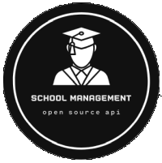

#

<p align="center">
  <a href="" rel="noopener">
 </a>
</p>

<h3 align="center">School Management</h3>
<br>
<div align="center">

  ![Status][status]
  ![GitHub repo size][repo-size]
  ![GitHub last commit][last-commit]
  ![License][license]
  [![code-climate-shield]][code-climate-link]
  [![codecov-shield]][codecov-link]
  [![fossa-shield]][fossa-link]
  [![action-codeql-shield]][action-codeql-link]
  [![action-lint-shield]][action-lint-link]
  [![action-dependency-shield]][action-dependency-link]
  [![travis-shield]][travis-link]
  [![action-dotnet-shield]][action-dotnet-link]
  [![action-build-shield]][action-build-link]
  <!-- [![actions-ghpages-shield]][actions-ghpages-link] -->
  <!-- ![Requires.io (branch)][requires-io] -->
  <!-- ![GitHub issues][issues]
  ![GitHub pull requests][pull-requests]
  ![GitHub forks][forks]
  ![GitHub stars][stars] -->
  <!-- ![GitHub All Releases][releases]
  ![GitHub language count][language-count]
  ![GitHub top language][top-language] -->
</div>

---

<p align="center"> English | <a href="./README.pt-BR.md">Português (Brasil)</a><br><br>A simple School Management Web API built with ASP.NET 6 using TDD and Clean Architecture (under development).
  <br>
</p>

## 📝 Table of Contents

- [About](#about)
- [Documentation](./docs/index.md)
- [Getting Started](#getting_started)
- [Deployment](#deployment)
- [Usage](#usage)
- [Built Using](#built_using)
- [TODO](./TODO.md)
- [Contributing](#contributing)
- [Authors](#authors)
- [Acknowledgments](#acknowledgement)

## 🧐 About <a name = "about"></a>

{TODO} Write about 1-2 paragraphs describing the purpose of your project.

## 🏁 Getting Started <a name = "getting_started"></a>

{TODO} These instructions will get you a copy of the project up and running on your local machine for development and testing purposes. See [deployment](#deployment) for notes on how to deploy the project on a live system.

### Prerequisites

{TODO} What things you need to install the software and how to install them.

<!-- ```
Give examples
``` -->

### Installing

{TODO} A step by step series of examples that tell you how to get a development env running.

<!-- Say what the step will be

```
Give the example
```

And repeat

```
until finished
``` -->

End with an example of getting some data out of the system or using it for a little demo.

## 🧪 Running the tests <a name = "tests"></a>

{TODO} Explain how to run the automated tests for this system.

### Break down into end-to-end tests

{TODO} Explain what these tests test and why

<!-- ```
Give an example
``` -->

### And coding style tests

{TODO} Explain what these tests test and why

<!-- ```
Give an example
``` -->

## 💿 Usage <a name="usage"></a>

{TODO} Add notes about how to use the system.

## 🚀 Deployment <a name = "deployment"></a>

{TODO} Add additional notes about how to deploy this on a live system.

## ⛏️ Built Using <a name = "built_using"></a>

- [Visual Studio 2022](https://visualstudio.microsoft.com/vs/)
- [ASP.NET 6](https://docs.microsoft.com/en-us/aspnet/core/introduction-to-aspnet-core?view=aspnetcore-6.0)
- [Entity Framework 6](https://docs.microsoft.com/en-us/ef/core/)
- [SQL Server 2019](https://www.microsoft.com/pt-br/sql-server/sql-server-2019)
- [Azure](https://azure.microsoft.com/en-us/)

## 👨‍💻 Contributing <a name = "contributing"></a>

Check out the [contribution guidelines](./CONTRIBUTING.md) and follow our [code of conduct](./CODE_OF_CONDUCT.md) if you want to contribute to this project.

## ✍️ Authors <a name = "authors"></a>

- [@filimor](https://github.com/filimor/) - Idea & Initial work

<!-- See also the list of [contributors][contributors] who participated in this project. -->

### Contact

- E-mail: filimor@posteo.net
- LinkedIn: [https://www.linkedin.com/in/filimor/](https://www.linkedin.com/in/filimor/)
- Twitter: [https://www.twitter.com/filimorbr/](https://www.twitter.com/filimorbr/)

## 📜 License

This project is licensed under the GNU Public License version 3.0 - see the [License](./LICENSE "GPLv3") file for details.

[![fossa-image]][fossa-link2]

## 🎉 Acknowledgements <a name = "acknowledgement"></a>

- [The-Documentation-Compendium](https://github.com/kylelobo/The-Documentation-Compendium)
- [Contributor Covenant](https://www.contributor-covenant.org/)
- [Gitignore.io](https://www.toptal.com/developers/gitignore)

<!-- SHIELDS -->
[status]: https://img.shields.io/badge/status-active-success.svg
[action-dotnet-shield]: https://github.com/filimor/school-management/actions/workflows/dotnet.yml/badge.svg
[action-build-shield]: https://github.com/filimor/school-management/actions/workflows/azure-webapps-dotnet-core.yml/badge.svg
[action-codeql-shield]: https://github.com/filimor/school-management/actions/workflows/codeql-analysis.yml/badge.svg
[action-dependency-shield]: https://github.com/filimor/school-management/actions/workflows/dependency-review.yml/badge.svg
[action-lint-shield]: https://github.com/filimor/school-management/actions/workflows/super-linter.yml/badge.svg
[actions-ghpages-shield]: https://github.com/filimor/school-management/actions/workflows/pages/pages-build-deployment/badge.svg
[code-climate-shield]: https://api.codeclimate.com/v1/badges/bb1611309b93f8822b90/maintainability
[fossa-shield]: https://app.fossa.com/api/projects/git%2Bgithub.com%2Ffilimor%2Fschool-management.svg?type=shield
[codecov-shield]: https://codecov.io/gh/filimor/school-management/branch/main/graph/badge.svg?token=cnBHSjPQEZ
[travis-shield]: https://app.travis-ci.com/filimor/school-management.svg?branch=main

<!-- LINKS -->
[test]: https://link

[code-climate-link]: https://codeclimate.com/github/filimor/school-management/maintainability
[travis-link]: https://app.travis-ci.com/filimor/school-management
[codecov-link]: https://codecov.io/gh/filimor/school-management
[requires-io]: https://img.shields.io/requires/github/filimor/school-management/main
[issues]: https://img.shields.io/github/issues-raw/filimor/school-management
[pull-requests]: https://img.shields.io/github/issues-pr-raw/filimor/school-management
[forks]: https://img.shields.io/github/forks/filimor/school-management
[stars]: https://img.shields.io/github/stars/filimor/school-management
[repo-size]: https://img.shields.io/github/repo-size/filimor/school-management
[releases]: https://img.shields.io/github/downloads/filimor/school-management/total
[language-count]: https://img.shields.io/github/languages/count/filimor/school-management
[top-language]: https://img.shields.io/github/languages/top/filimor/school-management
[last-commit]: https://img.shields.io/github/last-commit/filimor/school-management
[license]: https://img.shields.io/github/license/filimor/school-management
[contributors]: https://github.com/filimor/school-management/contributors
[action-dotnet-link]: https://github.com/filimor/school-management/actions/workflows/dotnet.yml
[action-build-link]: https://github.com/filimor/school-management/actions/workflows/azure-webapps-dotnet-core.yml
[action-codeql-link]: https://github.com/filimor/school-management/actions/workflows/codeql-analysis.yml
[action-dependency-link]: https://github.com/filimor/school-management/actions/workflows/dependency-review.yml
[action-lint-link]:  https://github.com/filimor/school-management/actions/workflows/super-linter.yml
[actions-ghpages-link]: https://github.com/filimor/school-management/actions/workflows/pages/pages-build-deployment
[fossa-link]: https://app.fossa.com/projects/git%2Bgithub.com%2Ffilimor%2Fschool-management?ref=badge_shield
[fossa-link2]: https://app.fossa.com/projects/git%2Bgithub.com%2Ffilimor%2Fschool-management?ref=badge_large

<!--IMAGES -->
[fossa-image]: https://app.fossa.com/api/projects/git%2Bgithub.com%2Ffilimor%2Fschool-management.svg?type=large